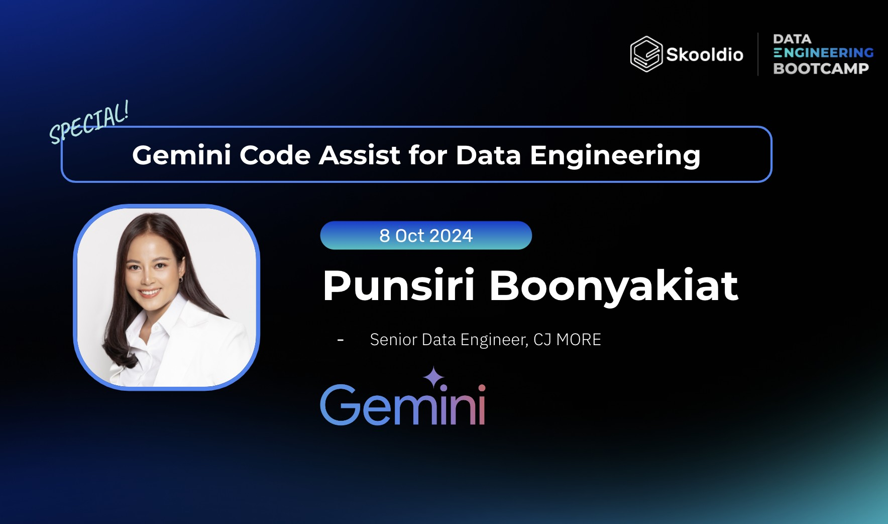

# [Skooldio DEB] Gemini Code Assist for Data Engineering

<p align="center" width="100%">
     
</p>

## 🎉 แนะนำตัว
ผู้สอน: ปุณณ์สิริ บุณยเกียรติ (บีท) </br>
Senior Data Engineer, CJ MORE

## 🗓️ สิ่งที่คุณจะได้พบ

ใน Workshop วันนี้เราจะครอบคลุมหัวข้อต่าง ๆ ดังนี้:

### Gemini Code Assist Workshops
1. [Setup Google Cloud Environment + Gemini Code Assist](documents/01_set_up_gemini_code_assist.md)
2. [Set up local Airflow environment](documents/02_set_up_airflow_env.md)

### Folder Explaination 
```md
deb-gemini-code-aasist/
│
├── README.md
└── assets/
└── dags/
└── runable_dags/
└── documents/
└── prompts/
└── cred/
└── tests/
```

| Name | Description |
| - | - |
| `assets/` | โฟลเดอร์ที่เก็บ assets เช่นรูปภาพต่างๆ หรือ diagram
| `dags/` | โฟลเดอร์ที่เก็บโค้ด DAG หรือ Airflow Data Pipelines ที่เราสร้างจะใช้ใน workshop เพื่อทดสอบความสามารถของ Gemini Code Assist |
| `runable_dags/` | โฟลเดอร์ที่เก็บโค้ด DAG หรือ Airflow Data Pipelines ที่เป็นเฉลยของ workshop ใช้งานได้  |
| `docker-compose.yaml` | ไฟล์ Docker Compose ที่ใช้รัน Airflow ขึ้นมาบนเครื่อง |
| `prompts/`| โฟลเดอร์ที่เก็บ prompts ที่ใช้ในการ Generate Code หรือ Query
| `cred/` | โฟลเดอร์ที่เก็บไฟล์ Credential หรือ Configuration อย่างไฟล์ `sa.json` |
| `tests/` | โฟลเดอร์ที่เก็บไฟล์ unitest เพื่อทำการทดสอบ python code |
