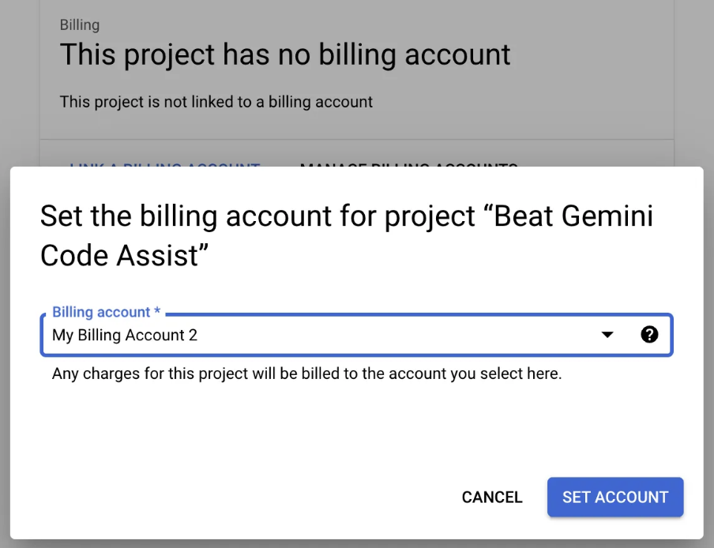
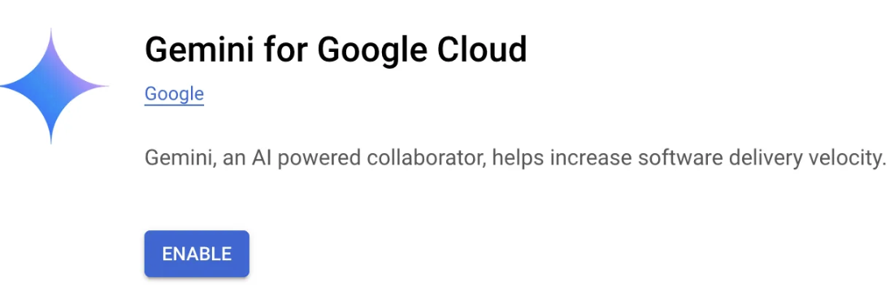
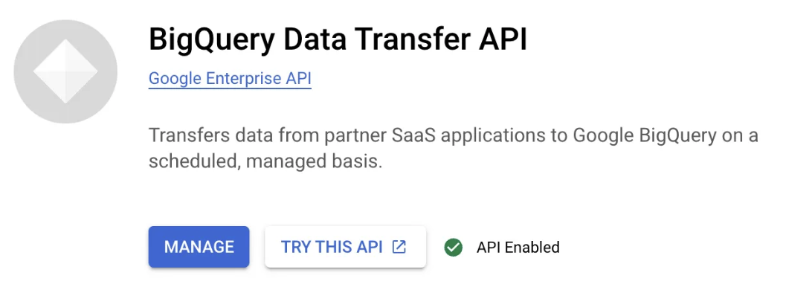

# 1. Set up Google Cloud Platform Environment

### ** สามารถทำก่อนเข้าห้องเรียนได้ แต่ในห้องจะมีอีกรอบค่ะ :) 

การ Set up Google Cloud Platform Environment เป็นการเตรียมความพร้อมทั้งในเรื่องของโปรเจกต์, บริการที่ต้องการใช้, รวมถึงการตั้งค่า Credential และ Environment ต่าง ๆ ที่เกี่ยวข้อง เพื่อให้พร้อมใช้งานอย่างเต็มรูปแบบ โดยมีขั้นตอนดังนี้:

[1.0 Create New GCP Project]()  

[1.1 Enable API  - Gemini for Google Cloud]() 

[1.2 Create GSC bucket for Data Pipeline]()

[1.3 Create Service Account for Airflow Access]() 

[1.4 Create BigQuery Dataset]() 

[1.5. Clone data from public Dataset : TheLook e-commerce]()


### วิธีการสร้าง GCP Project ผ่าน Google Cloud Console

1. **ไปที่หน้า Google Cloud Console**
2. **กรอกข้อมูลโปรเจคใหม่:**
    - **Project Name**: ใส่ชื่อโปรเจคใหม่ที่ต้องการ (เช่น `Beat Gemini Code Assist`)
    - **Project ID**: กำหนด `project_id` (หรือใช้ค่าที่แนะนำโดย Google)
    - **Billing Account**: เลือกบัญชี Billing ที่ต้องการเชื่อมต่อ (หากยังไม่มี ให้สร้าง Billing Account ใหม่)
3. **คลิก `Create`** เพื่อสร้างโปรเจคใหม่
4. อย่าลืมกด Link Billing 
    
    


## **1.1 Enable API  - Gemini for Google Cloud**

เพื่อเปิดใช้งาน API สำหรับ Gemini ใน Google Cloud คุณสามารถทำตามขั้นตอนดังนี้:



- เข้าไปที่ Google Cloud Console
- ไปที่ `Navigation Menu` > `API & Services` > `Library > ค้นหา Gemini for Google Cloud` หรือ คลิก Link : https://console.cloud.google.com/apis/library/cloudaicompanion.googleapis.com
- หรือสามารใช้คำสั่ง `gcloud` เพื่อเปิดใช้งาน API ใน Cloud Shell ได้ดังนี้

Click **Activate Cloud Shell** at the top of the Google Cloud console.

```bash
gcloud services enable cloudshell.googleapis.com
```

ประกาศตัวแปรเพื่อการ Setup 

- `[YOUR_PROJECT_ID]` ให้แก้เป็นชื่อ project ที่เราใช้ทำงาน
- `[YOUR_NAME]` ให้แก้ไขชื่อ Bucket ที่จะสร้าง เป็นชื่อตัวเอง เช่น `deb-gemini-code-assist-beat`

```jsx
export PROJECT_ID="[YOUR_PROJECT_ID]"
export GCS_BUCKET_NAME="deb-gemini-code-assist-[YOUR_NAME]"
```

```jsx
export SERVICE_ACCOUNT_NAME="sa-gemini-airflow"
export BQ_DATASET_NAME="gemini_assist_workshop" 

echo $PROJECT_ID
echo $GCS_BUCKET_NAME
echo $SERVICE_ACCOUNT_NAME
```

## 1.2 Create GSC bucket for Data Pipeline

 สร้าง Bucket ใหม่ เพื่อใช้ในการเป็น Data lake ของ Data pipeline ในการวาง ไฟล์ raw / processed

```bash
gsutil mb gs://$GCS_BUCKET_NAME/
gsutil ls
```

## 1.3 Create Service Account for Airflow Access

- สร้าง Service Account เพื่อใช้ใน Airflow ให้วางไฟล์ได้ใน GCS หรือสร้าง Table ใน BigQuery ได้

โดยเราสามารถสร้างโดยใช้ CLI หรือ command line interface ได้

```bash
gcloud iam service-accounts create $SERVICE_ACCOUNT_NAME \
    --description="The service account used for Airflow to access GCP" \
    --display-name="SA_GEMINI_AIRFLOW_CODE_ASSIST"
```

- ให้สิทธิ์กับ Service Account ในการเข้าถึง BigQuery และ GCS

```jsx
gcloud projects add-iam-policy-binding $PROJECT_ID \
    --member="serviceAccount:$SERVICE_ACCOUNT_NAME@$PROJECT_ID.iam.gserviceaccount.com" \
    --role="roles/bigquery.admin"

gcloud projects add-iam-policy-binding $PROJECT_ID \
    --member="serviceAccount:$SERVICE_ACCOUNT_NAME@$PROJECT_ID.iam.gserviceaccount.com" \
    --role="roles/storage.admin"
```

- สร้างและดาวน์โหลด Key สำหรับ Service Account
- เข้าไปที่ Google Cloud Console
- ไปที่ `Navigation Menu` > `API & Services` > `Library > ค้นหา Gemini for Google Cloud`

## 1.4 Create BigQuery Dataset

ในการสร้าง dataset ใน BigQuery ผ่าน CLI (Command-Line Interface) สามารถใช้คำสั่ง `bq` ได้ตามตัวอย่างด้านล่างนี้:

```bash
bq --location=[location] mk -d [project_id]:[dataset_name]
```

อธิบายพารามิเตอ

- `-location`: ใช้ระบุ region (optional) เช่น `US` หรือ `asia-southeast1` เป็นต้น
- `mk -d`: สร้าง dataset โดยใช้คำสั่ง `mk` และ flag `d` สำหรับ dataset
- `[project_id]`: ชื่อของโปรเจคใน Google Cloud (ไม่จำเป็นต้องใส่ถ้าคุณกำหนดโปรเจคใน `bq` CLI ไว้แล้ว)
- `[dataset_name]`: ชื่อของ dataset ที่ต้องการสร้าง

### ตัวอย่างการใช้งาน

```bash
bq --location=asia-southeast1 mk -d $PROJECT_ID:$BQ_DATASET_NAME
```

## 1.5. Clone data from public Dataset : TheLook e-commerce

Enable BigQuery Transfer service. -  ต้องเปิดใช้งาน **BigQuery Data Transfer Service API** ในโปรเจคปลายทางก่อนใช้คำสั่งนี้:

```bash
gcloud services enable bigquerydatatransfer.googleapis.com 
```

หากต้องการ clone ทั้ง dataset `thelook_ecommerce` ไปยังโปรเจค  และเก็บใน dataset ของเรา ชื่อ `gemini_assist_workshop`:

```bash

bq mk --transfer_config \
  --project_id=$PROJECT_ID \
  --data_source=cross_region_copy \
  --target_dataset=$BQ_DATASET_NAME \
  --display_name="Clone thelook_ecommerce Dataset" \
  --params='{"source_dataset_id":"thelook_ecommerce","source_project_id":"bigquery-public-data"}'

```

